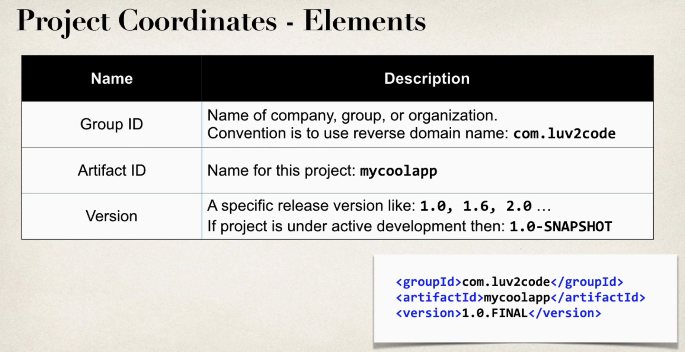
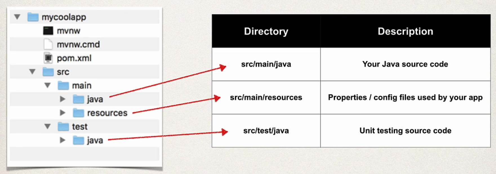
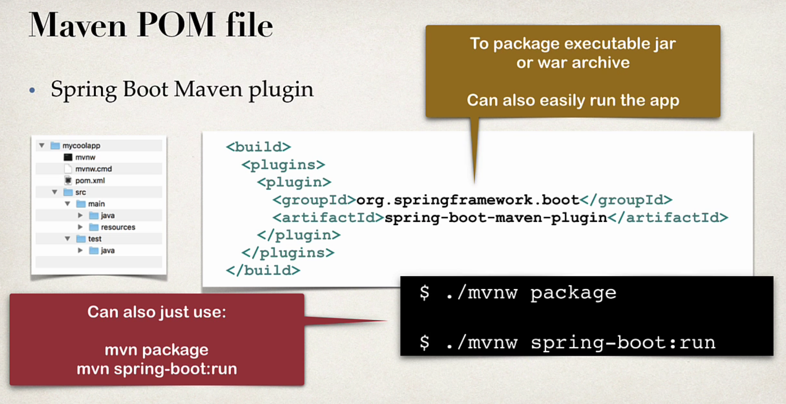

# **Things to know before starting Spring Framework:**

## Topics:
**1. Library vs Framework**<br>
**2. Difference between JAR and WAR**<br>
**3. Difference between `jar` and `jar.original` in Spring Boot**<br>
**4. What is POJO?**<br>
**5. POM File - pom.xml**<br>
**6. Running a Spring Boot Application**<br>
**7. Application.properties** <br>
**8. Difference between `application.properties` and `application.yml`**

<br>

## **1. Library vs Framework**


<br>

## **2. Difference between JAR and WAR:**

<br>


## **3. Difference between `jar` and `jar.original` in Spring Boot**
* 👉
    | File           | Created by         | Contains                              | Runnable |
    | -------------- | ------------------ | ------------------------------------- | -------- |
    | `jar.original` | Maven              | Only project code                     | ❌ No     |
    | `jar`          | Spring Boot plugin | Code + dependencies + embedded server | ✅ Yes    |

<br>

## **4. What is POJO?**
* **POJO is a Java class that:**
    - Has private fields
    - Usually has getters and setters
    - Usually has a default constructor
    - Does not depend on any framework-specific classes or interfaces

<br>

## **5. POM File - pom.xml**
* **It is an XML file that contains:** 
    - `Information about the project,` 
    - `Project dependencies,`
    - `And configuration details used by Maven to build and manage the project.`<br>
* 👉 **Basically our** `shopping list` **for Maven.**

* **Project Coordinates: (GAV)**   


* **Maven Standard Directory Structure:** 


* **Maven POM file**


<br>


## **6. Running a Spring Boot Application**
* **A Spring Boot application can be executed in `two main ways`**:
    1.  Using **Maven command**
    2.  Using the **executable JAR file**

* 
    ### **1️⃣ Running with Maven:**
    * 
        ``` bash
        mvn spring-boot:run
        ```

    *   **Requirements:**
        -   You **must be inside the project directory**
        -   The directory must contain the **`pom.xml` file**

    *   **Why this is required:** **Maven reads the `pom.xml` to understand:**
        -   Project configuration
        -   Dependencies
        -   Plugins
        -   Build instructions

    *   **What Maven does internally:**
        -   Reads `pom.xml`
        -   Downloads dependencies (if missing)
        -   Compiles the source code
        -   Starts the Spring Boot application

        **Example workflow:**

        ``` bash
        cd my-spring-app
        mvn spring-boot:run
        ```

------------------------------------------------------------------------
* 
    ### **2️⃣ Running using Executable JAR:**
    *   First build the project to generate the JAR file.
        ``` bash
        mvn clean package
        ```

    *   **What this command does:**
        -   Cleans previous build files
        -   Compiles the code
        -   Runs tests
        -   Packages the application into a **JAR file**

    *   The generated JAR file will be inside the **target directory**.
        - **Example:** `target/demo-0.0.1-SNAPSHOT.jar`

    *   Now run the application:
        ``` bash
        java -jar target/demo-0.0.1-SNAPSHOT.jar
        ```

    * `This starts the Spring Boot application.`

------------------------------------------------------------------------
### **👉 Running the JAR from Any Directory**
* **Unlike Maven commands, the JAR can be executed `from any folder` as long as the `path to the JAR is correct`**.
* **Example:**

    ``` bash
    java -jar /home/user/my-spring-app/target/demo-0.0.1-SNAPSHOT.jar
    ```
* 
    ### Key Difference
    | Method                | Requirement |
    |---------------------- |-------------|
    | `mvn spring-boot:run` | Must run inside the **project directory** (needs `pom.xml`) |
    | `java -jar`           | Can run from **any directory** if the JAR path is correct |

<br>

## **7. Application.properties**
*   **It is a `primary configuration` file in a Spring Boot application. It uses `key = value` format.** <br><br>
*   **You can configure various aspects of a Spring Boot application using this file:**
    1. **Server settings:** `Change the default embedded server port from 8080.`

        ``` properties
        server.port=8081
        ```

    2. **Database connection:** `Configure datasource properties for different databases (e.g., MySQL, H2, PostgreSQL).`
        ``` properties
        spring.datasource.url=jdbc:mysql://localhost:3306/mydb
        spring.datasource.username=root
        spring.datasource.password=password
        ```

    3. **Logging levels:** `Adjust the logging verbosity for different packages or the entire application.`
        ``` properties
        logging.level.root=INFO
        logging.level.com.example=DEBUG
        ```

    4. **Custom properties:** `Define your own application-specific properties that can be accessed in your code.`
        ``` properties
        app.name=My Spring Boot Application
        ```
* Here:


<br>

## **8. Difference between `application.properties` and `application.yml`**
* 
    | Feature                           | `application.properties`                         | `application.yml`                                   |
    |----------------------------------|--------------------------------------------------|-----------------------------------------------------|
    | **Format:**                       | `key=value` **pairs**                          | **YAML format (keys with indentation)**                 |
     | **Execution Priority:**           | **Lower priority**                                   | **Higher priority (overrides `.properties` if both exist)** |
    | **Structure:**                    | Flat structure                                   | Hierarchical / nested structure                     |
    | **Readability:**                  | Good for small configurations                    | Better for large configurations                     |
    | **Configuration Length:**         | Longer property names for nested configurations  | Shorter due to hierarchical structure               |
    | **Syntax Sensitivity:**           | Less sensitive                                   | Indentation is very important                       |
    | **File Extension:**               | `.properties`                                    | `.yml` or `.yaml`                                   |
   